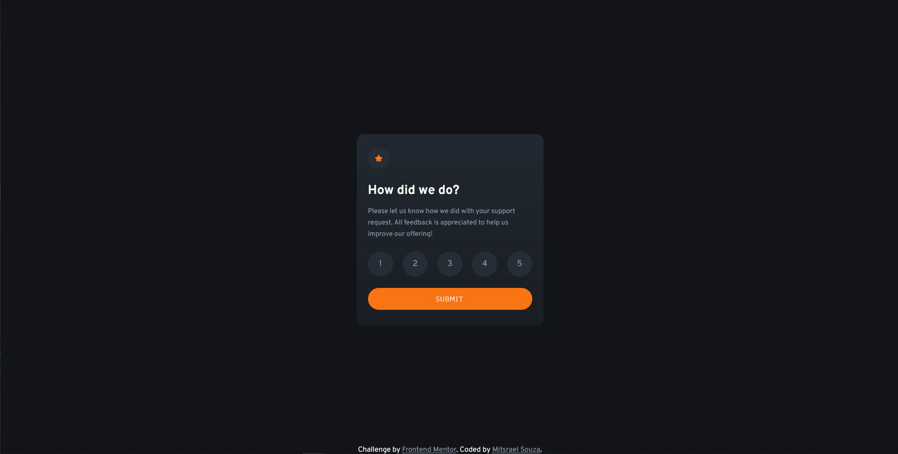
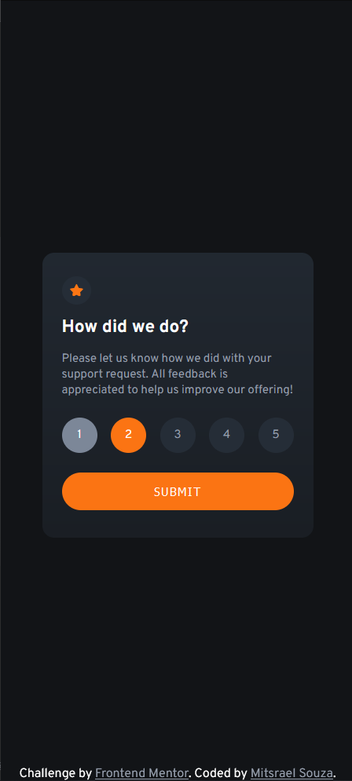

# Frontend Mentor - Interactive rating component solution

This is a solution to the [Interactive rating component challenge on Frontend Mentor](https://www.frontendmentor.io/challenges/interactive-rating-component-koxpeBUmI). Frontend Mentor challenges help you improve your coding skills by building realistic projects.

## Table of contents

-   [Overview](#overview)
    -   [The challenge](#the-challenge)
    -   [Screenshot](#screenshot)
    -   [Links](#links)
-   [My process](#my-process)
    -   [Built with](#built-with)
    -   [What I learned](#what-i-learned)
    -   [Continued development](#continued-development)
    -   [Useful resources](#useful-resources)
-   [Author](#author)

## Overview

This project is an example of an duncional rating component.

### The challenge

Users should be able to:

-   View the optimal layout for the app depending on their device's screen size
-   See hover states for all interactive elements on the page
-   Select and submit a number rating
-   See the "Thank you" card state after submitting a rating

### Screenshot

<div align="center">
    
  
  <br /><br /><br />


<br /><br /><br />

</div>

### Links

-   Solution URL: [GitHub source code](https://github.com/M-its/interative-rating-component)
-   Live Site URL: [Product preview card component page](https://m-its.github.io/interative-rating-component/)

## My process

### Built with

-   Semantic HTML5 markup
-   CSS custom properties
-   Flexbox
-   CSS Grid
-   Mobile-first workflow
-   [SASS](https://sass-lang.com/) - CSS preprocessor
-   Vanilla JavaScript

### What I learned

In this project i learned how to submit a form with the GET method and display the results on a modal, and I also could pratice changing the state of HTML elements with JavaScript. Like that

```js
function displayModal() {
    let alert = null

    form.addEventListener("submit", (event) => {
        event.preventDefault()
        if (rating !== null) {
            form.style.display = "none"
            givenRate.innerHTML = ` ${rating} `
            modal.style.display = "flex"
        } else {
            if (alert === null) {
                alert = button.insertAdjacentHTML(
                    "afterend",
                    "<p class='alert'>*Please select a valid rating</p>"
                )
            }
        }
    })
}
```

### Continued development

I need to improve my aproach with modals and learn more about JavaScript native functions and how to deal with forms.

### Useful resources

-   [W3Schools - How TO - CSS/JS Modal](https://www.w3schools.com/howto/howto_css_modals.asp) - This article helped me understend how do modals work.

-   [Hora de Codar - Como pegar parâmetros GET da URL com JavaScript](https://horadecodar.com.br/como-pegar-parametros-get-da-url-com-javascript/) - This article explains how to get parameters from the URL.

-   [Stack Overflow - Remover parâmetro da URL com JavaScript](https://pt.stackoverflow.com/questions/47977/remover-par%C3%A2metro-da-url-com-javascript) - This post have some expamples of how to remove parameter drom the URL.

-   [MDN web docs - Element.insertAdjacentHTML()](https://developer.mozilla.org/pt-BR/docs/Web/API/Element/insertAdjacentHTML) - This article has useful examples about how to insert HTML elements with JavaScript.

-   [Animista - Shake Horizontal](https://animista.net/play/attention/shake/shake-horizontal) - This is the tool I used to create the animation effect when no rating was submited.

-   [W3Schools - CSS Animations](https://www.w3schools.com/css/css3_animations.asp) - This article helped me understend th implemantation of the CSS Animations.

## Author

-   GitHub - [@M-its](https://github.com/M-its)
-   Frontend Mentor - [@M-its](https://www.frontendmentor.io/profile/M-its)
-   Codepen - [@M-its](https://codepen.io/m-its)
